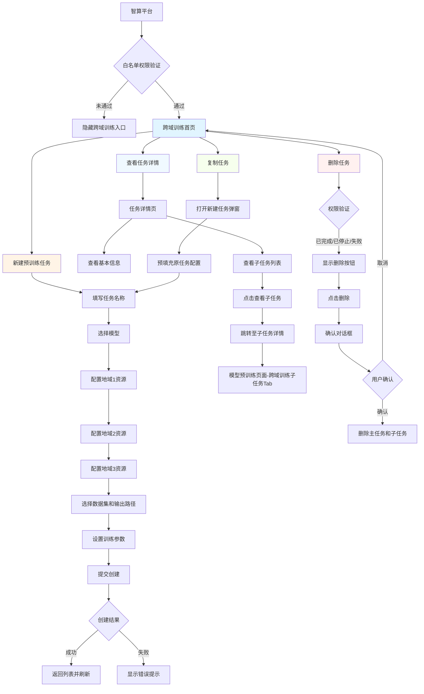

# 跨域训练UI走查计划

## 1. 走查目标

### 1.1 总体目标
确保跨域训练功能的UI实现与设计稿在视觉和体验上保持一致，验证所有UI元素、交互状态和异常流程的完整性和正确性。

### 1.2 具体目标
- **视觉一致性**：验证颜色、字体、图标、间距等视觉元素符合设计规范
- **功能完整性**：确保所有功能模块的UI元素完整，无遗漏
- **交互流畅性**：验证用户操作流程的UI反馈及时、准确
- **异常处理**：确保异常场景下的UI表现优雅、友好
- **响应式适配**：验证不同屏幕尺寸下的布局表现
- **可访问性**：确保符合可访问性标准，支持键盘导航和屏幕阅读器

### 1.3 验收标准
- 所有UI元素与设计稿一致度达到100%
- 所有交互状态（默认、悬停、点击、禁用、加载等）都有对应的UI表现
- 所有异常场景都有友好的错误提示和处理机制
- 所有页面在不同屏幕尺寸下都能正常显示

---

## 2. 走查方法

### 2.1 走查方式说明

UI走查采用**两种方式相结合**的方法，确保既覆盖所有UI元素，又验证整体用户体验的连贯性：

#### 方式一：按点走查（用例走查）
- **定义**：按照UI走查用例清单，逐条检查每个UI元素和检查点
- **目的**：确保所有UI元素都被检查到位，无遗漏
- **适用场景**：
  - 首次走查，确保全面覆盖
  - 修复验证，确保问题已解决
  - 回归走查，确保无新问题
- **执行方式**：按照CSV用例清单，逐条执行并记录结果

#### 方式二：按流程走查（场景走查）
- **定义**：模拟真实用户操作流程，按照业务流程进行端到端走查
- **目的**：验证整体用户体验的连贯性、流畅性和逻辑性
- **适用场景**：
  - 核心业务流程验证
  - 跨页面交互验证
  - 用户体验流畅性验证
- **执行方式**：按照业务流程流程图，完整执行用户操作路径，检查每个环节的UI表现

### 2.2 两种方式的结合使用

**推荐走查顺序**：
1. **先按流程走查**：快速验证核心流程的完整性和流畅性，发现明显的体验问题
2. **再按点走查**：系统性地检查每个UI元素，确保无遗漏
3. **最后流程验证**：修复问题后，再次按流程走查，验证整体体验

**两种方式的互补性**：
- 按点走查：发现细节问题（颜色、字号、间距、状态等）
- 按流程走查：发现体验问题（跳转逻辑、状态同步、数据传递等）

### 2.3 核心业务流程清单

基于需求文档，识别以下核心业务流程需要按流程走查：

| 流程编号 | 流程名称 | 流程路径 | 检查重点 |
|----------|----------|----------|----------|
| 流程1 | 创建跨域训练任务 | 跨域训练首页 → 新建任务弹窗 → 填写表单 → 提交创建 → 返回列表 | 表单验证、四级联动、数据提交、操作反馈 |
| 流程2 | 查看跨域训练任务详情 | 跨域训练首页 → 任务详情页 → 子任务列表 → 子任务详情 | 页面跳转、数据传递、状态同步 |
| 流程3 | 删除跨域训练任务 | 跨域训练首页 → 点击删除 → 确认对话框 → 删除成功 | 权限控制、二次确认、操作反馈 |
| 流程4 | 复制跨域训练任务 | 跨域训练首页 → 点击复制 → 新建任务弹窗（预填充） → 提交创建 | 数据预填充、表单验证、操作反馈 |
| 流程5 | 任务状态变更监控 | 跨域训练首页/详情页 → 实时监控状态变化 | 状态同步、UI更新、主子任务联动 |
| 流程6 | 白名单权限验证 | 智算平台导航 → 跨域训练入口 → 权限验证 | 菜单显示/隐藏、权限提示 |

### 2.4 流程走查检查要点

在执行流程走查时，重点关注以下方面：

- **页面跳转**：跳转是否流畅，是否有过渡动画，数据是否正确传递
- **状态同步**：跨页面的状态是否同步（如主任务状态与子任务状态）
- **数据传递**：页面间数据传递是否正确，返回时状态是否保持
- **操作反馈**：每个操作是否有及时、明确的反馈
- **错误处理**：异常情况下的UI表现是否友好
- **视觉连贯性**：整个流程中的视觉风格是否统一

---

## 3. 走查团队信息

| 角色 | 姓名 | 联系方式 | 职责 |
|------|------|----------|------|
| UI设计师 | 【待填写】 | 【待填写】 | 提供设计稿、设计规范，参与走查评审 |
| 前端开发 | 【待填写】 | 【待填写】 | 实现UI界面，修复UI问题 |
| 后端开发 | 【待填写】 | 【待填写】 | 提供接口支持，配合前端调试 |
| UI走查负责人 | 【待填写】 | 【待填写】 | 组织走查活动，记录问题，跟踪修复 |
| 产品经理 | 【待填写】 | 【待填写】 | 确认需求理解，参与验收 |

**备注**：请填写实际团队成员信息

---

## 4. 走查时间计划

**走查开始日期**：【待填写】

**预计完成日期**：【待填写】

**总计预计耗时**：【待填写】天

> **估算建议**：根据模块数量和复杂度，本次走查涉及4个主要模块，预计每个模块0.5-1天，全局检查0.5天，问题修复验证1-2天，总计约4-6天。

---

## 5. 走查模块清单

### 5.1 模块统计
本次走查共涉及 **5个主要模块**，**113个UI走查用例**。

### 5.2 模块详细清单

| 序号 | 模块名称 | 页面/功能 | 用例数量 | 优先级 | 备注 |
|------|----------|----------|----------|--------|------|
| 1 | 跨域训练首页 | 页面布局、任务列表、全局按钮、筛选查询 | 24 | 高 | 核心入口页面 |
| 2 | 新建跨域训练任务 | 任务创建表单、四级联动、输入验证 | 29 | 高 | 核心创建流程 |
| 3 | 跨域训练任务详情 | 任务详情展示、子任务列表、跳转交互 | 11 | 高 | 核心监控页面 |
| 4 | 跨域训练子任务 | 子任务列表、子任务详情、状态同步 | 8 | 高 | 子任务管理 |
| 5 | 全局检查 | 视觉一致性、交互反馈、可访问性、异常流程 | 32 | 高 | 全局规范检查 |
| 6 | 场景流程 | 完整业务流程、异常场景、边界场景 | 10 | 高 | 端到端验证 |
| 7 | 上下游模块 | 导航入口、数据依赖、跳转链接 | 9 | 高 | 模块集成验证 |

---

## 6. 模块串联逻辑与流程图

### 6.1 模块串联流程图

---

## 7. 模块上下游影响分析

### 7.1 新增模块说明

本次新增的**跨域训练**模块是智算平台的一个新功能模块，位于"高阶能力"下。该功能支持三地混训，为超大规模模型预训练提供高效稳定支撑。

### 7.2 上游模块（依赖模块）

| 上游模块 | 依赖关系 | 影响说明 | 验证要点 |
|----------|----------|----------|----------|
| 智算平台导航 | 入口依赖 | 跨域训练需要在智算平台导航菜单中显示入口 | 检查"高阶能力-跨域训练"菜单项的显示和隐藏逻辑（白名单控制） |
| 帮助中心 | 跳转依赖 | 跨域训练首页的操作指引需要跳转至帮助中心 | 检查"跨域网络打通"链接是否正确跳转至帮助中心对应文档 |
| 项目空间管理 | 数据依赖 | 创建任务时需要选择项目空间 | 检查项目空间下拉框的数据加载、空状态提示、跳转链接 |
| 资源管理/专属集群 | 数据依赖 | 创建任务时需要选择专业版专属集群 | 检查专属集群下拉框的数据加载、空状态提示、跳转链接 |
| 文件存储/对象存储 | 数据依赖 | 创建任务时需要选择输出路径 | 检查输出路径选择器是否正确加载地域1的存储资源 |
| 数据集管理 | 数据依赖 | 创建任务时需要选择数据集 | 检查数据集下拉框是否正确加载平台预置数据集 |

**设计师填写**：
- 上游模块是否会影响跨域训练模块的UI展示？【待填写】
- 上游模块的UI变更是否需要同步更新跨域训练模块？【待填写】

### 7.3 下游模块（被影响模块）

| 下游模块 | 影响关系 | 影响说明 | 验证要点 |
|----------|----------|----------|----------|
| 模型预训练页面 | 新增Tab | 在模型预训练页面新增"跨域训练子任务"Tab | 检查Tab的显示和隐藏逻辑（白名单控制）、Tab样式、Tab切换交互 |
| 单域训练子任务详情 | 复用逻辑 | 跨域训练子任务详情页复用单域训练子任务详情页 | 检查跨域训练子任务详情页与单域训练子任务详情页的UI一致性 |

**设计师填写**：
- 跨域训练模块的UI变更是否会影响下游模块？【待填写】
- 是否需要在下游模块中增加跨域训练相关的UI元素？【待填写】

### 7.4 上下游验证用例

基于上下游影响分析，已在UI走查用例中增加以下验证点：

1. **上游模块验证**：
   - UI-TC106：检查智算平台导航菜单中"跨域训练"入口的显示和隐藏逻辑
   - UI-TC107：检查从跨域训练首页跳转至帮助中心的链接和内容
   - UI-TC108：检查项目空间下拉框的数据加载和空状态提示
   - UI-TC109：检查专属集群下拉框的数据加载和空状态提示
   - UI-TC110：检查从新建任务弹窗跳转至资源管理/专属集群的链接

2. **下游模块验证**：
   - UI-TC111：检查模型预训练页面中"跨域训练子任务"Tab的显示逻辑
   - UI-TC112：检查跨域训练子任务详情页是否复用单域训练子任务详情页
   - UI-TC113：检查子任务详情页中是否显示主任务信息和跳转链接

---

## 8. 补充内容

### 8.1 走查环境要求

| 环境类型 | 要求 | 说明 |
|----------|------|------|
| 浏览器 | Chrome 90+、Safari 14+、Firefox 88+ | 支持现代浏览器特性 |
| 屏幕尺寸 | 1920x1080、1366x768、1024x768 | 覆盖主流屏幕尺寸 |
| 网络环境 | 正常网络、弱网、断网 | 测试不同网络条件下的UI表现 |
| 权限环境 | 白名单用户、非白名单用户 | 测试权限控制 |

### 8.2 设计规范参考

设计规范参考地址：http://100.76.6.155:6611/components/dropdown.html

请在设计规范系统中查看以下内容：
- 颜色规范：主色#1890FF、辅助色、错误色#ff4d4f、成功色#52c41a、警告色#faad14等
- 字体规范：标题16px/字重500、正文14px/字重400、辅助文字12px等
- 间距规范：表单项间距24px、按钮内边距8px 16px、页面边距24px等
- 组件规范：按钮、输入框、下拉框、表格等组件的样式和交互规范

### 8.3 走查工具

| 工具类型 | 工具名称 | 用途 |
|----------|----------|------|
| 设计稿查看 | Pixso | 对比设计稿和实现效果 |
| 屏幕测量 | 浏览器开发者工具 | 测量尺寸、颜色、间距 |
| 截图工具 | Snipaste/系统截图 | 记录问题和对比效果 |
| 用例管理 | Excel/CSV | 记录和管理走查用例 |
| 问题跟踪 | 项目管理工具 | 跟踪问题修复进度 |

### 8.4 走查检查清单

#### 视觉一致性检查清单
- [ ] 颜色使用是否符合设计规范（主色#1890FF、错误色#ff4d4f等）
- [ ] 字体类型、字号、字重是否统一（标题16px、正文14px等）
- [ ] 图标风格、尺寸、颜色是否一致（16x16px线性图标）
- [ ] 间距、边距是否符合设计规范（表单项24px、页面边距24px等）
- [ ] 圆角、阴影等视觉效果是否一致（按钮圆角2px、弹窗阴影等）

#### 组件状态检查清单
- [ ] 所有按钮的默认、悬停、点击、禁用、加载状态
- [ ] 所有输入框的占位符、已输入、聚焦、错误、禁用状态
- [ ] 所有下拉框的默认、展开、选中、禁用状态
- [ ] 所有链接的默认、已访问、悬停状态
- [ ] 启停开关的开启、关闭、过渡动画状态

#### 交互反馈检查清单
- [ ] 数据加载时是否有加载动画（骨架屏/loading）
- [ ] 操作成功/失败时是否有提示（Toast/Modal）
- [ ] 页面跳转是否有过渡动画（淡入淡出300ms）
- [ ] 按钮点击是否有反馈效果（按压效果100ms）

#### 异常流程检查清单
- [ ] 输入验证错误提示是否清晰（任务名称格式、迭代次数范围等）
- [ ] 操作失败时是否有错误提示和重试机制
- [ ] 空状态是否有友好提示（任务列表为空、项目空间为空等）
- [ ] 边界条件是否有相应处理（任务名称30字符、迭代次数1-1000等）
- [ ] 数据保护提示是否明确（填写表单到一半返回时提示）
- [ ] 删除操作是否有二次确认（确认对话框）
- [ ] 白名单权限控制是否正确（菜单显示/隐藏、403提示）

#### 响应式检查清单
- [ ] 1920px宽度下的布局表现（居中显示、最大宽度1200px）
- [ ] 1366px宽度下的布局表现（自适应宽度、表格列宽缩放）
- [ ] 1024px宽度下的布局表现（无横向滚动条）
- [ ] 内容过长时的截断处理（任务名称省略号、Tooltip显示）

#### 可访问性检查清单
- [ ] 是否支持键盘导航（Tab键依次聚焦）
- [ ] 焦点指示是否清晰（蓝色外发光2px）
- [ ] 颜色对比度是否满足WCAG标准（对比度≥4.5:1）
- [ ] 点击区域是否足够大（按钮32x32px、链接24x24px）

### 8.5 问题记录模板

| 问题编号 | 模块 | 检查点 | 问题描述 | 严重程度 | 优先级 | 负责人 | 状态 | 修复日期 |
|----------|------|--------|----------|----------|--------|--------|------|----------|
| UI-BUG-001 | 跨域训练首页 | 任务列表 | 任务名称过长时未显示省略号 | 中 | 中 | 【待填写】 | 待修复 | 【待填写】 |

**严重程度**：高（阻塞功能）、中（影响体验）、低（轻微问题）

**优先级**：高（立即修复）、中（尽快修复）、低（后续修复）

---

## 9. 附录

### 9.1 相关文档

- 需求文档：`需求文档.md`
- UI走查规范：`AI生成UI走查用例规则.md`
- UI走查用例：`UI用例/跨域训练-UI走查用例-1.csv`
- 设计规范：http://100.76.6.155:6611/components/dropdown.html

### 9.2 联系方式

如有疑问或需要补充信息，请联系：
- UI走查负责人：【待填写】
- 产品经理：【待填写】

---

**文档版本**：v1.0  
**创建日期**：2025年11月9日  
**最后更新**：2025年11月9日  
**文档状态**：待完善（需要填写团队信息和日期信息）
